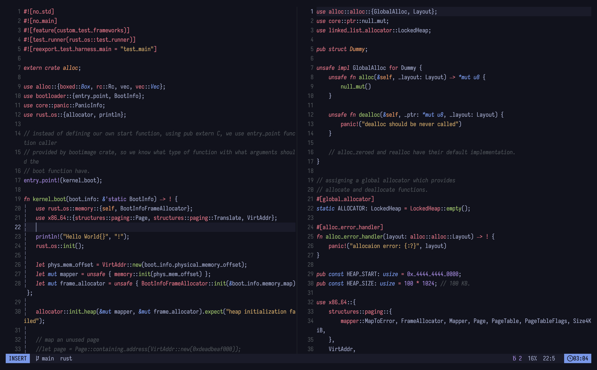

<h1>nvim config</h1>

The config structure is inspired from [LazyVim](https://github.com/LazyVim/LazyVim) and therefore uses [lazy.vim](https://github.com/folke/lazy.nvim). The config provides these features OTB:

- code formatting with autopairs, formatting with [conform.nvim](https://github.com/stevearc/conform.nvim), diagnostics with [trouble.nvim](https://github.com/folke/trouble.nvim)
- Search and replace in project with [spectre](https://github.com/nvim-pack/nvim-spectre)
- LSP support with [lsp-zero](https://github.com/VonHeikemen/lsp-zero.nvim), [mason](https://github.com/williamboman/mason.nvim), [nvim-cmp](https://github.com/hrsh7th/nvim-cmp), everything lazy loaded for best performance.

- modern UI with support for [lualine](https://github.com/nvim-lualine/lualine.nvim), [noice](https://github.com/folke/noice.nvim) and [notify](https://github.com/rcarriga/nvim-notify) plugins.

## About
I wanted to make this config entirely for myself in the beginning, but when learning how to setup nvim with everything that is needed in order to do my daily tasks, I realized its tough. I was using another config before this (check [here](https://github.com/genzyy/nveeeem/tree/stable)) but the LSP part of it was 90% copied from other configs and was confusing for me to know how it actually worked together. Most of the times there were some bugs that I ignored but wasn't able to do that for long.

After this I decided to create my own config that is 100% written by me, and is well documented too. During this I also learned why lazy.nvim was created.As we keep adding more and more plugins to nvim config, it keeps getting slower and behaves same as how commonly used editors do. Therefore I have tried to keep the number of plugins as low as possible and only use that are NEEDED and can be lazily loaded. I plan to keep it this way.

__Note__: Having a lot of LSPs and linters installed will not be a problem. They are lazily loaded too (thanks to folke for lazy.nvim!) and will not affect performance too much.

